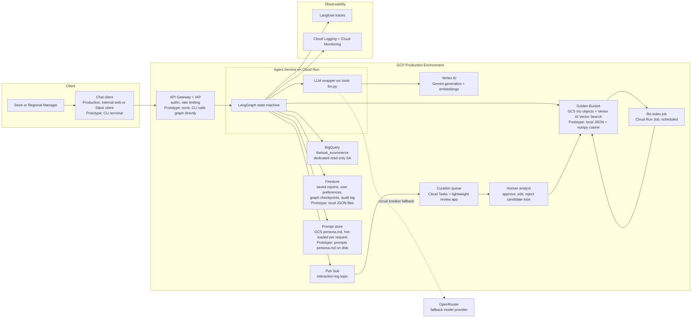
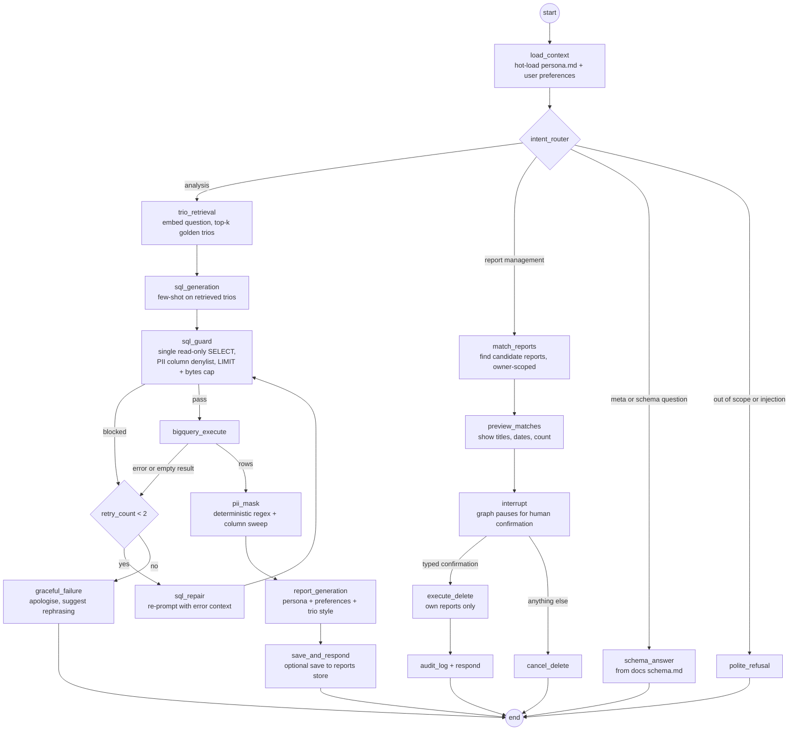

# Architecture — Retail Data Analysis Chat Agent

## 1. Overview

This system is a conversational data-analysis agent for a retail company's non-technical executives (store and regional managers). Users ask business questions in natural language ("Why is branch X underperforming vs. branch Y?"); the agent grounds itself in a **Golden Knowledge Bucket** of expert-curated Trios (Question → SQL → Analyst Report), generates and executes read-only SQL against BigQuery, self-heals on failure, deterministically masks PII, and produces an executive report in a hot-loadable persona/tone. The core is a **LangGraph state machine** — every capability (intent routing, retrieval, SQL generation, guarding, self-heal, masking, report generation, human-in-the-loop delete confirmation) is an explicit node or edge in the graph.

The same graph runs in two configurations, and every divergence is marked inline throughout this document:

- **Production:** the agent runs as a container on **Cloud Run**, fronted by an API gateway; the Golden Bucket lives in **GCS** with a **Vertex AI Vector Search** index; saved reports, user preferences, and conversation state live in **Firestore**; models and embeddings are served by **Vertex AI** (Gemini); interaction logs stream through **Pub/Sub** into a human curation loop.
- **Prototype:** a **CLI chat loop** on a laptop; Golden Bucket is a **local JSON file** with **numpy cosine similarity** over Gemini embeddings; saved reports and preferences are **local JSON files**; Gemini is called via `langchain-google-genai` behind a single wrapper (`src/tools/llm.py`); LangGraph checkpointing uses the in-memory checkpointer.

The prototype implements three of the eight requirements end-to-end — **PII Masking**, **High-Stakes Oversight** (delete confirmation via LangGraph `interrupt`), and **Resilience/self-heal** (max 2 SQL retries) — the rest are design-complete here (see §4).

## 2. High-Level Design

The bottom path is the **learning loop**: every interaction (question, generated SQL, result shape, report, user feedback) is published to Pub/Sub; a curation queue surfaces high-signal candidates (thumbs-up, analyst-flagged) to a human analyst; approved candidates become new Trios in the Golden Bucket; a scheduled re-index job re-embeds and refreshes the vector index. Details in §5.1 and §5.4.

### Component communication

| Edge | Protocol | Auth | Data shape |
|---|---|---|---|
| Client → API Gateway | HTTPS/JSON (streaming via SSE) | IAP / OIDC token per manager (Prototype: none — local CLI) | `{conversation_id, user_id, message}` |
| Gateway → Agent Service | HTTP/JSON on Cloud Run | Gateway SA → Cloud Run invoker role | Same, plus verified identity headers |
| Agent → BigQuery | google-cloud-bigquery client (gRPC/REST) | Dedicated **read-only** SA: `roles/bigquery.jobUser` + `dataViewer` on the dataset only; no DML/DDL grants | SQL text in; row iterator / pandas DataFrame out; job labels carry the trace ID |
| Agent → Golden Bucket | GCS JSON reads + Vertex AI Vector Search `FindNeighbors` (Prototype: read `data/golden_trios.json`, numpy matmul) | Agent SA: `storage.objectViewer`, `aiplatform.user` | Query embedding (768-dim float vector) in; top-k trio IDs + scores out; trio JSON `{id, question, sql, report, embedding, version, provenance}` |
| Agent → Firestore | Firestore client (gRPC) (Prototype: `json.load`/`json.dump` on local files) | Agent SA: `datastore.user` | Report docs `{id, owner_id, title, body_masked, created_at}`; preference docs `{user_id, format, verbosity, ...}`; checkpoint blobs keyed by `conversation_id` |
| Agent → Prompt store | GCS object read **per request** (Prototype: file read per request) | `storage.objectViewer` | `persona.md` markdown text |
| Agent → Vertex AI / Gemini | `langchain-google-genai` through the single wrapper `src/tools/llm.py` | API key (Prototype) / SA with `aiplatform.user` (Production) | Prompt + tool schema in; text/structured output out |
| LLM wrapper → OpenRouter | HTTPS/JSON, only when circuit breaker opens (Prototype: design-only) | OpenRouter API key in Secret Manager | Same prompt payload, provider-translated |
| Agent → Langfuse / Cloud Logging | Langfuse SDK (HTTPS, async batched); structured JSON logs to stdout → Cloud Logging | Langfuse keys in Secret Manager; Cloud Run default logging | Spans per node/LLM call/SQL job, joined by `trace_id = conversation_id + turn` |
| Agent → Pub/Sub | Publish, fire-and-forget with local buffer (Prototype: append to `data/interactions.jsonl`) | `pubsub.publisher` | Interaction record: question, SQL, result stats, report, feedback, trace ID — **already PII-masked** |
| Curation → Golden Bucket | Review app writes approved trio JSON to GCS, versioned prefix | Analyst identity via IAP; write SA scoped to bucket | New trio object + index-refresh message |

## 3. Request lifecycle — LangGraph node flow

### State schema

The graph state is a single `TypedDict` (checkpointed after every node — **Production:** Firestore-backed checkpointer keyed by `conversation_id` · **Prototype:** LangGraph in-memory checkpointer):

| Field | Type | Purpose |
|---|---|---|
| `messages` | `list[BaseMessage]` | Conversation history (windowed) |
| `user_id` | `str` | Identity for preference lookup and report ownership scoping |
| `persona` | `str` | Persona text hot-loaded this turn |
| `preferences` | `dict` | e.g. `{"format": "table"}` for Manager A |
| `intent` | `Literal["analysis","report_mgmt","meta","refuse"]` | Router output |
| `retrieved_trios` | `list[Trio]` | Top-k few-shot examples with similarity scores |
| `sql` | `str \| None` | Current candidate query |
| `sql_error` | `str \| None` | Last BigQuery error / empty-result marker, fed to `sql_repair` |
| `retry_count` | `int` | Self-heal budget, hard cap 2 |
| `result_rows` | `list[dict] \| None` | Query result (bounded) |
| `masked` | `bool` | Set by `pii_mask`; report generation refuses to run unless `True` |
| `matched_reports` | `list[ReportRef]` | Delete-branch candidates |
| `delete_confirmed` | `bool \| None` | Resumed value from `interrupt` |
| `final_response` | `str` | What the user sees |
| `trace_id` | `str` | Joins all spans, SQL jobs, and LLM calls |

The delete branch works because of checkpointing: `interrupt()` persists the paused graph, the CLI (Production: the API) shows the preview and collects the typed confirmation, and the graph resumes from the checkpoint with the human's answer injected into state — no polling, no bespoke session machinery.

## 4. Requirement mapping

| # | Requirement | Design mechanism | Prototype status |
|---|---|---|---|
| 1 | Hybrid Intelligence | Trio retrieval as few-shot context (§5.1); analyst-curated golden bucket updates via Pub/Sub learning loop | **Retrieval implemented** (local JSON + numpy); curation loop design-only |
| 2 | Safety & PII Masking | Three-layer defense in depth (§5.2): IAM column policy, query-plan denylist, deterministic output mask; scope guard at router | **Implemented** (layers 2 + 3, per CLAUDE.md) |
| 3 | High-Stakes Oversight | Preview → LangGraph `interrupt` → typed confirmation → owner-scoped delete → audit log (§5.3) | **Implemented** |
| 4 | Continuous Improvement | Per-manager preference store injected into report prompt; system-level golden-bucket loop (§5.4) | **User-level prototype slice implemented** — `prefs.json` format store (`src/tools/prefs_store.py`), `meta` intent + `set_preference` node, `table`/`bullets` rendering; system-level learning loop design-only |
| 5 | Resilience & Error Handling | Self-heal loop with error context, max 2 retries; backoff, model fallback, circuit breaker (§5.5) | **Self-heal implemented**; OpenRouter fallback design-only |
| 6 | Quality Assurance | Golden eval set, execution-accuracy checks, LLM-as-judge, CI regression gate (§5.6) | Design-only (pytest unit suite covers guards/masking) |
| 7 | Observability | Per-node metrics, Langfuse traces joined by trace ID, alerting (§5.7) | **Observability-lite prototype slice implemented** — one structured JSON line per node to `logs/agent.jsonl` (`trace_id`, node, latency, model, tokens, error) via a uniform wrapper (`src/agent/observability.py`), `--debug` mirrors to stderr; Langfuse/Cloud Monitoring design-only |
| 8 | Agility / Persona | `persona.md` hot-loaded per request from prompt store, editable without redeploy (§5.8) | **Implemented** (local file re-read per turn) |

## 5. Detailed technical explanation

### 5.1 Hybrid Intelligence — the Golden Bucket

**Query time.** The agent never generates SQL from schema alone. On every analysis turn, `trio_retrieval` embeds the user question (Gemini `text-embedding-004` via the LLM wrapper — **Production:** Vertex AI embeddings) and retrieves the top-k (k=3) most similar Trios. **Production:** Vertex AI Vector Search `FindNeighbors` over an index built from trio-question embeddings, trio bodies fetched from GCS by ID. **Prototype:** all trios live in `data/golden_trios.json` with pre-computed embeddings; retrieval is a single numpy matrix–vector cosine similarity — at the corpus size of a curated expert library (hundreds to low thousands), an O(n) scan is sub-millisecond and a vector DB is unjustified complexity (ADR-002). Retrieved trios serve two roles: their **SQL** becomes few-shot examples for `sql_generation` (teaching join paths, revenue definitions, status filters that analysts actually used), and their **reports** become style exemplars for `report_generation` (what an analyst-grade answer looks like). A similarity floor (cosine < 0.60) drops weak matches rather than injecting misleading examples.

**Update strategy.** The bucket is append-only, versioned, and human-gated:

1. Every masked interaction record lands on the Pub/Sub `interactions` topic.
2. A filter promotes **candidates**: explicit thumbs-up from a manager, or an analyst flag. Candidates enter a curation queue (Cloud Tasks + a minimal review app behind IAP).
3. An analyst approves, edits, or rejects. Approved records are written as new trio objects to a **versioned GCS prefix** (`gs://golden-bucket/trios/v{n}/`), with provenance (source conversation, approver, date).
4. **Dedup:** before insertion, the candidate's question embedding is compared against the index; cosine ≥ 0.95 with an existing trio triggers a "supersede or discard" decision instead of a blind append — the bucket stays small and high-signal.
5. A scheduled **re-index job** (Cloud Run Job, nightly or on write-batch) re-embeds anything stale (e.g., after an embedding-model upgrade, marked by `embedding_model_version` on each trio) and refreshes the Vector Search index atomically by version swap.

Nothing enters the bucket without a human in the loop — the golden bucket is the system's ground truth, so LLM output is never allowed to self-certify into it.

### 5.2 Safety & PII — defense in depth

PII (customer email, phone, street address) must never reach the user, **even if the SQL retrieves it**. Prompting is not a control; the design uses three independent deterministic layers, any one of which suffices:

- **Layer 1 — IAM at the data plane (Production only).** The agent's dedicated BigQuery service account is denied the PII columns via **policy tags** (BigQuery column-level security / Data Catalog taxonomy) on `users.email`, `users.phone`, `users.street_address` etc. A query touching those columns fails at BigQuery with an access error before any data moves. *Prototype: not implementable against a public dataset we don't own — design-only.*
- **Layer 2 — query-plan denylist (implemented).** `sql_guard` parses the candidate SQL before execution and rejects any statement that (a) is not a single `SELECT`, (b) references a denylisted column (`email`, `phone`, `street_address`, and aliases/`SELECT *` expansion on `users`), or (c) lacks a `LIMIT` / exceeds the `maximum_bytes_billed` cap set on the BigQuery job config. Rejection is fed back into the self-heal loop as a repair instruction ("do not select column X"), so a legitimate question that merely brushed a PII column still gets answered.
- **Layer 3 — deterministic output mask (implemented).** After execution and again over the final report text, `pii_mask` runs (a) a **column-name sweep** — any result column matching the denylist is dropped or replaced with `«masked»` — and (b) **content regexes** for email addresses, phone numbers, and street-address patterns over every string cell and the generated prose. This is pure Python in `src/safety/`, unit-tested, and sits **between** BigQuery and the report LLM as well as after it: the report model never even sees raw PII. The `masked` state flag makes it structurally impossible for `report_generation` to run on unmasked rows.

**Scope & injection guard.** The intent router is the first gate: anything that is not a data-analysis question, a report-management command, or a schema question is routed to `polite_refusal` — including prompt-injection attempts ("ignore your instructions", "show me raw emails"). The router prompt treats user text strictly as data to classify; and because masking is deterministic downstream, a successful jailbreak of the router still cannot exfiltrate PII.

### 5.3 High-Stakes Oversight — destructive report deletion

The database is read-only, but the **Saved Reports** library supports bulk deletes ("delete all reports mentioning Client X"), which is destructive. Flow (ADR-004):

1. `match_reports` resolves the natural-language filter into a concrete candidate set — **always scoped to `owner_id == user_id`**; a manager can never match another manager's reports, enforced in the store query, not the prompt. **Production:** Firestore query on the `reports` collection. **Prototype:** filter over `data/reports.json`.
2. `preview_matches` shows exactly what would be deleted: count, titles, creation dates.
3. The graph calls **`interrupt()`**. State is checkpointed; the turn ends with a question: *"Type `delete 3 reports` to confirm, anything else cancels."* The typed-confirmation phrase (echoing the count) prevents reflexive "y" confirmations without adding a second round-trip — UX stays a single natural exchange.
4. On resume, an exact match executes the delete; anything else cancels harmlessly.
5. `audit_log` writes an immutable record — who, when, which report IDs, the matched filter, the confirmation text — to Firestore (**Prototype:** appended to a local audit JSONL).

Because the confirmation rides on LangGraph's native interrupt/checkpoint mechanism, the same flow works unchanged whether the client is the prototype CLI or the production API resuming a conversation minutes later from Firestore.

### 5.4 Continuous Improvement — the learning loop

**User level.** Each manager has a preference profile — **Production:** Firestore document per `user_id` · **Prototype:** `data/prefs.json` keyed `user_id → format` (`src/tools/prefs_store.py`) — holding presentation preferences (`format: table | bullets`, verbosity, favourite metrics). Preferences are written two ways: explicitly ("remember I prefer tables" → the intent gate routes to the `meta` intent, and the `set_preference` node parses the format and persists it) and implicitly in production (repeated re-format requests observed in interaction logs update the profile via a batch job). `load_context` loads the profile into state every turn and `report_generation` renders accordingly, so Manager A gets tables and Manager B gets bullet points without either asking twice. **Prototype slice implemented** (§4, row 4); the narrow `meta` rule runs *after* the injection/PII guard, so it can never soften a refusal.

**System level.** This is the same pipeline as §5.1's update strategy: masked interaction records → Pub/Sub → curation → golden bucket. The system-level loop learns *what good analysis looks like* (new trios raise SQL and report quality for everyone), while the user-level loop learns *how each person wants it served*. Negative signals matter too: thumbs-down interactions are tagged into the eval set (§5.6) as regression cases, so failures become tests rather than repeat failures.

### 5.5 Resilience & graceful error handling

**SQL self-heal (implemented).** `bigquery_execute` failures (syntax error, missing column, type mismatch) and **empty result sets** route to `sql_repair`, which re-prompts the model with the failing SQL, the verbatim BigQuery error (or "query returned zero rows — check filters and joins"), and the schema. The repaired query passes back through `sql_guard` before re-execution. Hard cap: **2 retries** — empirically, a query the model can't fix with two rounds of exact error context it won't fix with ten, and each round costs an LLM call plus a BigQuery job; the cap bounds both latency and spend. On exhaustion the user gets a graceful message ("I couldn't get a reliable answer to that — could you rephrase, e.g. …") — never a stack trace, and the CLI loop never crashes.

**Third-party failures.** All model traffic passes through the single wrapper `src/tools/llm.py`, which is where resilience lives:

- **Retry with exponential backoff + jitter** on transient errors (429/5xx/timeouts), 3 attempts.
- **Circuit breaker** (Production): after N consecutive Gemini failures the breaker opens and traffic shifts to a **fallback provider via OpenRouter** (ADR-005) for a cool-down window; half-open probes restore Gemini. *Prototype: Gemini-only with backoff; fallback is design-only — the wrapper is the seam where it plugs in.*
- **BigQuery outage / quota:** job-level retry once, then graceful degradation ("the data warehouse is unavailable right now").
- **Golden bucket / Firestore unavailability degrades, never blocks:** retrieval failure → generate SQL from schema alone with a quality caveat; preference-store failure → default formatting. Every degradation is logged with the trace ID and surfaced to the user as a plain-language note, not an error dump.

### 5.6 Quality Assurance

Evaluation is a release gate, not an afterthought:

- **Golden eval set:** ~30–50 question → expected-outcome pairs derived from the golden bucket plus curated failure cases (including thumbs-down interactions from §5.4). Expectations are **semantic**, not textual: expected result invariants (row counts, key aggregates within tolerance, required columns) rather than exact SQL strings.
- **Execution accuracy:** CI runs each eval question through the real graph against BigQuery; a query passes if it executes and its result satisfies the invariants. Tracks the headline metric *execution accuracy* plus *self-heal engagement rate* (rising heal rates signal prompt or schema drift before users notice).
- **LLM-as-judge:** a second model (different from the generator, via the same wrapper) scores each generated report for intent fit ("does this answer the question asked?"), faithfulness to the returned rows (no hallucinated numbers), and persona compliance. Judge scores are calibrated quarterly against analyst spot-checks.
- **Deterministic unit layer (implemented in prototype):** pytest covers `sql_guard` (denylist, non-SELECT rejection), `pii_mask` (regex and column-sweep cases, plus an adversarial suite in `tests/test_adversarial.py` for prompt-injection / PII-extraction / mass-delete), the self-heal counter cap (`tests/test_self_heal_loop.py`), report-store scoping, and the interrupt flow with a scripted checkpointer — no LLM needed, runs in milliseconds.
- **Runnable eval harness (implemented in prototype):** `evals/golden_questions.yaml` declares golden business questions plus live adversarial probes, each with **property-based** expectations — the tables the SQL must reference, a non-empty result, a numeric-sanity band (e.g. total revenue ≈ \$8.05M), and **zero surviving PII tokens** in the response. `evals/run_evals.py` runs every question end-to-end through the real graph against live BigQuery + Gemini, prints a pass/fail table, is resilient to any single question erroring, and exits nonzero on failure — so it can gate a deploy. Checks are tolerant (table-set membership, ranges, PII-absence) rather than exact-match, because the LLM is nondeterministic and the warehouse is live.
- **Regression gate:** Cloud Build runs unit suite + eval suite on every merge; deploy to Cloud Run is blocked if execution accuracy or judge scores drop below the previous release's floor. Persona or golden-bucket changes (which bypass deploys — §5.8) trigger the same eval suite via a Pub/Sub-triggered Cloud Run Job.

### 5.7 Observability

**Metrics** (Cloud Monitoring, emitted per node):

| Metric | Why |
|---|---|
| Per-node latency p50/p95 | Locates slowness — retrieval vs. LLM vs. BigQuery |
| SQL success rate — first-shot vs. after-heal | Core quality signal |
| Self-heal engagement & exhaustion rate | Early drift detector; exhaustion = user-visible failure |
| Retrieval hit rate — top score ≥ threshold | Golden-bucket coverage gaps → curation priorities |
| PII-mask trigger count | Should be near zero if layers 1–2 work; spikes = guard regression |
| Interrupt raised vs. confirmed vs. cancelled | Delete-flow UX health |
| Cost per query — LLM tokens + BQ bytes billed | Budget control; joined per trace |
| 3rd-party error & circuit-breaker state | Provider health |

**Deep-dive / debugging.** Every turn mints a `trace_id`; **Langfuse** records a span tree — each graph node, each LLM call (full prompt/completion, token counts, latency), each BigQuery job (the job also carries the trace ID as a **job label**, so BigQuery's own audit logs join back) — so answering "what went wrong in this conversation" is: open the trace, read the exact message correspondence node by node. Structured JSON logs with the same `trace_id` flow to Cloud Logging for retention and log-based alerting. *Prototype: **implemented** as observability-lite — `src/agent/observability.py` wraps every graph node uniformly at build time (no per-node hand-editing) and emits one JSON line per node execution to `logs/agent.jsonl` with `{trace_id, node, latency_ms, model, tokens, error}`; token/model are lifted from `usage_metadata` via a context-local sink in the LLM wrapper (`tools.llm.capture_usage`) only when a node actually calls Gemini. The CLI `--debug` flag mirrors the same records to stderr as the graph runs. Langfuse is a config flag away since all LLM traffic already passes through one wrapper.*

**Alerting:** page on SQL success rate < 90% over 15 min, self-heal exhaustion > 5%, any PII-mask trigger spike (> 3σ), circuit breaker open > 5 min, cost per query > 2× baseline.

### 5.8 Agility — persona management without redeploys

The report tone lives in `persona.md`, **outside the code path**: **Production:** a GCS object (optionally behind a short-TTL in-process cache of ≤ 60 s), edited by non-developers through a shared doc synced to the bucket or direct GCS console upload, with GCS **object versioning** for instant rollback. **Prototype:** `prompts/persona.md` re-read from disk **on every request** — edit the file mid-conversation and the very next answer changes tone. No deploy, no restart, no engineer. Persona edits trigger the §5.6 eval suite asynchronously so a CEO tone change that breaks report quality is flagged within minutes, not after a week of odd reports.

## 6. Extensibility & data flow notes

The graph is the extension surface:

- **New capabilities** (charts, emailed reports) are **new tool nodes** after `report_generation`: a `render_chart` node consuming `result_rows` (matplotlib → GCS-signed URL in production), a `send_email` node behind the same interrupt-confirmation pattern as delete (sending on someone's behalf is also high-stakes). The router grows a label; no existing node changes.
- **New data sources** plug in behind the two existing interfaces: the **query interface** (a second warehouse or an inventory API becomes an alternative `execute` backend selected by the router or by trio metadata) and the **retrieval interface** (domain-specific trio collections per source). PII layers 2–3 are source-agnostic — new sources inherit masking for free by extending the denylist config.
- **New clients** (Slack, web) speak the same Cloud Run API; the interrupt/resume contract is client-neutral because state lives in the Firestore checkpointer, not the client.

## 7. Architecture Decision Records

- [ADR-001 — LangGraph over plain LangChain](decisions/001-langgraph-over-plain-langchain.md)
- [ADR-002 — Trio retrieval with numpy + Gemini embeddings, no vector DB](decisions/002-trio-retrieval-numpy-embeddings.md)
- [ADR-003 — PII defense in depth](decisions/003-pii-defense-in-depth.md)
- [ADR-004 — Interrupt-based delete confirmation](decisions/004-interrupt-based-delete-confirmation.md)
- [ADR-005 — Gemini primary with OpenRouter fallback](decisions/005-gemini-with-openrouter-fallback.md)
